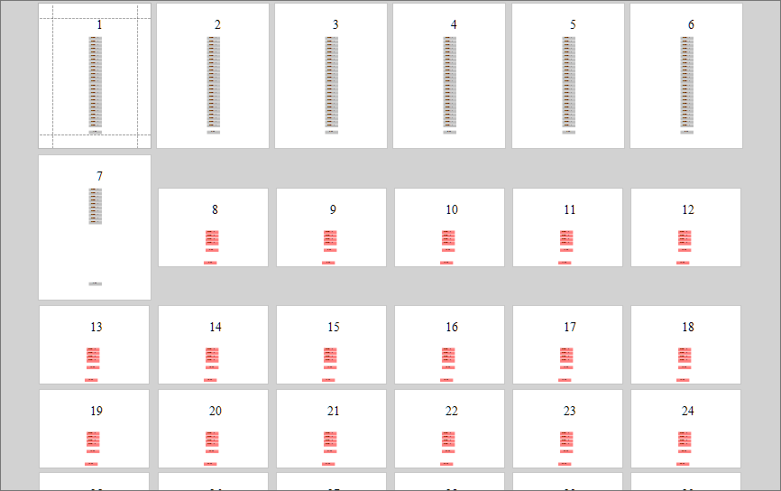
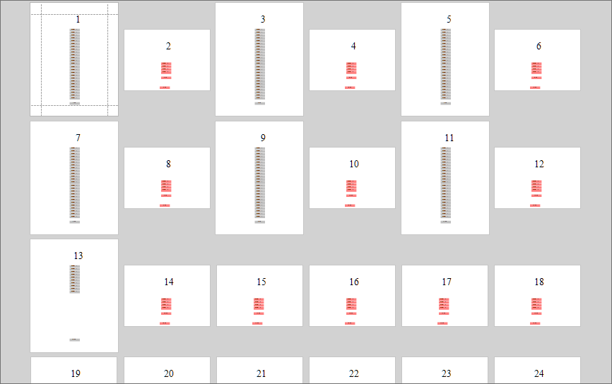
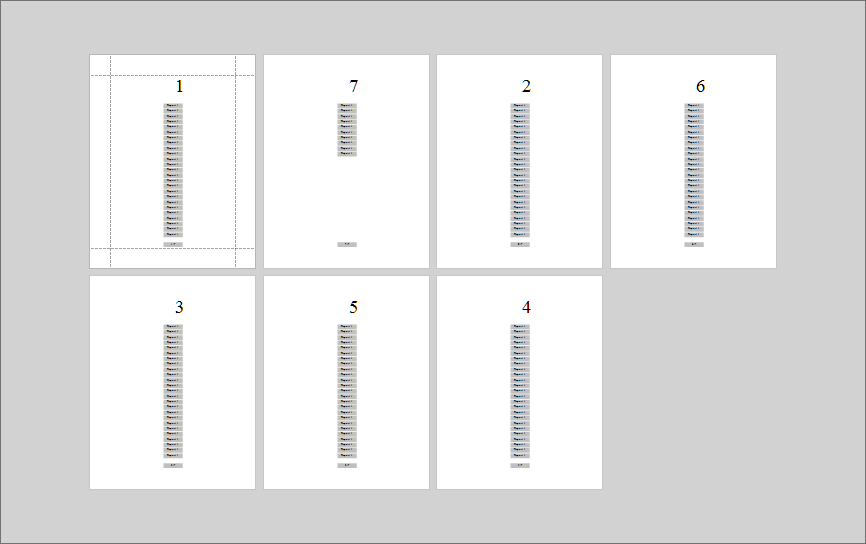

<!-- default badges list -->

<!-- default badges end -->
# Reporting for WinForms- How to combine document report pages

This example demonstrates how to add all pages of one report to the end of another report, how to merge pages of two reports into a single report and how to reorder report pages so that it can be printed as a booklet (first page, last page, second page, last but one, third page, and so on.)

Note that the resulting document is disposed of when the documents being merged are disposed of. You should print or export the resulting document after merge operations.

Combined reports:

Merge reports:

Reorder pages:

## Files to Review

* [Form1.cs](./CS/Form1.cs) (VB: [Form1.vb](./VB/Form1.vb))

## Documentation

- [Merge Reports](https://docs.devexpress.com/XtraReports/3320/detailed-guide-to-devexpress-reporting/merge-reports)
<!-- feedback -->
## Does this example address your development requirements/objectives?

 

(you will be redirected to DevExpress.com to submit your response)
<!-- feedback end -->
